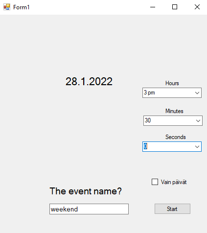
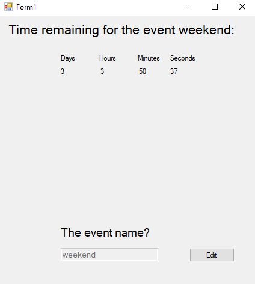

# CountdownTimer
Basic countdown timer for calculating the time to the selected date in days, hours, minutes and seconds.

# Features
- User can select a date from a calendar and can specify the event date even further by selecting hours, minutes and seconds.
- Ability to name your event
- Save and load system for checking time left for the event without re-entering the details.
- However if user feels like creating a new event or editing the current one, he can choose to edit the event anytime by using the "Edit" button.

